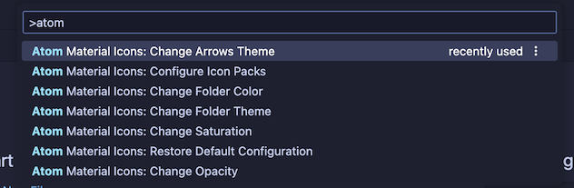
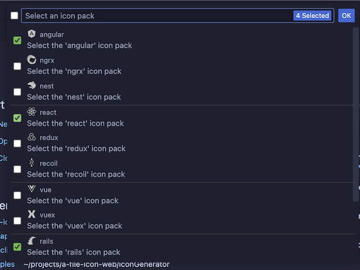
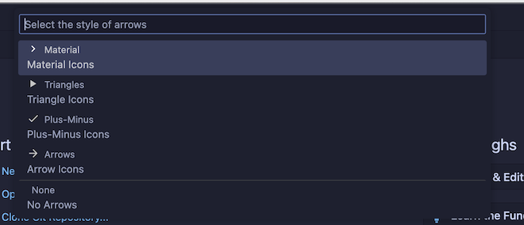
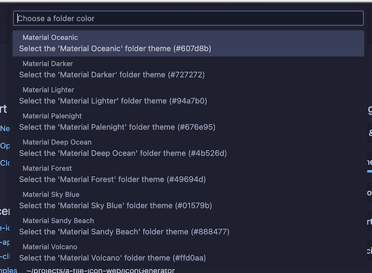
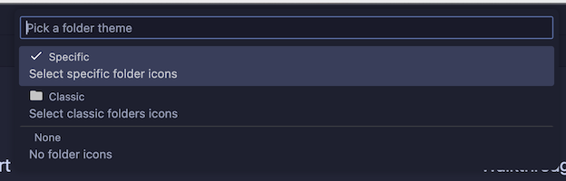
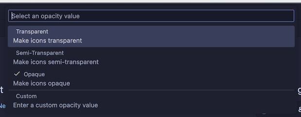
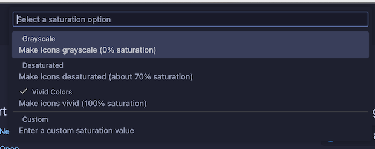
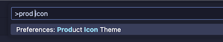
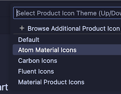

# Atom Material Icons Plugin for VSCode

<h1 align="center">
  <br>
    
  <br><br>
  Atom Material File Icons for VSCode
  <br>
  <br>
</h1>


This plugin is a port of the [Atom File Icons](https://github.com/file-icons/atom) for VSCode.

It replaces the icons and folder icons with better suited icons, related to the file type, framework or language.

This plugin is inspired by the [Material Icon Theme](https://github.com/PKief/vscode-material-icon-theme)
and [Atom Material Icons for JetBrains](https://github.com/mallowigi/a-file-icon-idea).

## Features

- Replaces **file icons** with their relevant logo icons
    - According to their extension (`.java`, `.php`, `.ruby`...)
    - According to the framework (Android, NPM, RSpec...)
    - According to the program used in conjonction (Babel, Docker, CircleCI...)
    - According to the parent directory (`.github/*`, `.vscode/*`...)
    - And others...
- Replaces **folder icons**:
    - From common patterns: `src`, `main`, `app`, `img`, `docs`...
    - From specific use cases: `node_modules`, `.vscode`, `.git.`..
- Provides it's own **Product Icons** from the _Material Design Icons_.

## Associations

You can find a list of all the available associations in the following links:

- [File Associations](https://material-theme.com/docs/reference/associations/)
- [Folder Associations](https://material-theme.com/docs/reference/folder-associations/)
- Language Associations (TODO)

## File Icons


## Folder Icons


---- 

## Usage

Since this extension is based off the
original [Material Icon Theme](https://github.com/PKief/vscode-material-icon-theme),
you can find most of the original settings here as well.

Therefore, this extension exposes a bunch of commands that you can invoke via the command palette:



Just type `Atom Material` in order to see the commands that are available.

----

## Settings

You can customize many aspects of the extension, either via the VSCode settings or by invoking the commands via the
command palette.

When setting the option via the _Preferences_, they will affect **all projects**, whereas the commands only
affect the **current workspace**.

---

### Icon Packs

While this extension contains a lot of icons, there are some icons that overlap with each other. For example, _Angular_,
and _NestJS_ use similar icon filename patterns. If you are working with an angular project you wouldn't want to see
NestJS icons and vice-versa.

This command will allow you to decide which pack(s) to enable for the current workspace.



> **Note**: Since you can enable multiple packs, there is still a way to enable both overlapping icon packs. It's
> recommended to not do as such as it would return unexpected results.

---

### Arrow Styles

You can customize the look of the arrows in the tree view using the command palette:



or via user settings:

```json
{
  "a-file-icon-vscode.arrowTheme": "material"
}
```

The available options are:

- `material`: Material Design arrows (chevrons)
- `triangle`: Triangle arrows
- `plusMinus`: Plus and minus signs
- `arrow`: Simple Arrows
- `none`: No arrows

> Note: This setting affects not only arrows from the tree view, but also arrows that you can find in many other places,
> such as the collapsible sections, code folding, etc.

> Another note: Arrows in the tree view work differently than arrows in the other places, as they are currently rotated
> from
> the "down arrow". As a result, some styles will display "weird results", such as the "Plus-Minus" style, that only
> displays the minus sign, but rotated. This could be solved via custom CSS in the future.

---

### Custom Folder Color

You can customize the color of the default folder icon using the command palette:



or via user settings:

```json
{
  "a-file-icon-vscode.folderColor": "#ef5350"
}

```

----

### Folder Theme

You can change the style of the folder icons using the command palette:



or via user settings:

```json
{
  "a-file-icon-vscode.folderTheme": "specific"
}
```

The available options are:

- `specific`: Replace specific folders, such as `src`, `main`, `app`, `img`, `docs`, etc.
- `classic`: Replace all folders with the default folder icon
- `none`: No folder icons

----

#### Custom icons' opacity

You can customize the opacity of the icons, between totally opaque to completely gone.

You can either choose a predefined opacity or enter your own opacity via the command palette:



or via user settings:

```json
{
  "a-file-icon-vscode.opacity": 0.5
}
```

---

## Custom icons' saturation

You can customize the saturation of the icons. The less saturated they are, the more grayscale they will appear.

You can either choose a predefined saturation or enter your own saturation via the command palette:



or via user settings:

```json
{
  "a-file-icon-vscode.saturation": 0.5
}
```

----

## Product Theme

In addition to file, folder and language icons, this extension also modifies the IDE's product icons to match the icons
of the JetBrains's equivalent extension and the Material Design Icons.




------

## Custom associations

> IMPORTANT: While this setting exists in the
> original [Material Icon Theme](https://github.com/PKief/vscode-material-icon-theme), it has not yet been implemented
> in this extension. But I'll leave the definition for the future.

You can customize the icon associations directly in the user settings.

### File associations

With the `*.[extension]` pattern you can define custom file icon associations. For example you could define an icon
for `*.sample` and every file that ends with `.sample` will have the defined icon. However, not all files with the same
file extension always have the same icon. For some specific file names there is a special icon. In order to overwrite
all the specific file icons as well, two asterisks must be set instead of one, i.e. `**.[extension]`.

If there's no leading `*` it will be automatically configured as filename and not as file extension.

```json
{
  "a-file-icon-vscode.files.associations": {
    "*.ts": "typescript",
    "**.json": "json",
    "fileName.ts": "angular"
  }
}
```

#### Custom SVG icons

It's possible to add custom icons by adding a path to an SVG file which is located relative to the extension's dist
folder. However, the restriction applies that the directory in which the custom icons are located must be within
the `extensions` directory of the `.vscode` folder in the user directory.

For example a custom SVG file called `sample.svg` can be placed in an `icons` folder inside of VS Code's `extensions`
folder:

```
.vscode
 ┗ extensions
   ┗ icons
     ┗ sample.svg
```

In the settings.json the icon can be associated to a file name or file extension like this:

```json
{
  "a-file-icon-vscode.files.associations": {
    "fileName.ts": "../../icons/sample"
  }
}
```

_Note: The custom file name must be configured in the settings without the file ending `.svg` as shown in the example
above._

### Folder associations

The following configuration can customize the folder icons. It is also possible to overwrite existing associations and
create nice combinations. For example you could change the folder theme to "classic" and define icons only for the
folder names you like.

```json
{
  "a-file-icon-vscode.folders.associations": {
    "customFolderName": "src",
    "sample": "dist"
  }
}
```

#### Custom SVG folder icons

Similar to the files, it is also possible to reference your own SVG icons for folder icons. Here it's important to
provide two SVG files: one for the folder if it's closed and another one for the opened state. These two files - let's
call them "folder-sample.svg" and "folder-sample-open.svg" - have to be placed into a directory which is relative to the
extensions dist folder. This directory has to be somewhere inside of the `.vscode/extensions` folder.

In our example we place them into an `icons` folder inside of the `.vscode/extensions` folder:

```
.vscode
 ┗ extensions
   ┗ icons
     ┣ folder-sample.svg
     ┗ folder-sample-open.svg
```

In the settings.json the folder icons can be associated to a folder name (e.g. "src") like this:

```json
{
  "a-file-icon-vscode.folders.associations": {
    "src": "../../../../icons/folder-sample"
  }
}
```

### Language associations

With the following configuration you can customize the language icons. It is also possible to overwrite existing
associations.

```json
{
  "a-file-icon-vscode.languages.associations": {
    "languageId": "iconName",
    "json": "json"
  }
}
```

## Commands

Here's a list of the available commands:

| Command                           | Description                                                                        |
|-----------------------------------|------------------------------------------------------------------------------------|
| **Arrows Style**                  | Change the style of the arrows in the project tree.                                |
| **Change Folder Color**           | Change the color of the folder icons.                                              |
| **Change Folder Theme**           | Change the design of the folder icons.                                             |
| **Change Opacity**                | Change the opacity of the icons.                                                   |
| **Change Saturation**             | Change the saturation value of the icons.                                          |
| **Icon Packs**                    | Select icon packs that enable additional icons (e.g. for Angular, React, Ngrx...). |
| **Restore Default Configuration** | Reset the default configurations of the icon theme.                                |

----

## Credits

Special credits to:

- [VSCode Material Icon Theme](https://github.com/PKief/vscode-material-icon-theme) for the implementation
- [Atom File Icons](https://github.com/file-icons/atom)
  and [Sublime Text A File Icon](https://github.com/SublimeText/AFileIcon) for the idea
- [Scientifics Study Vectors](https://www.svgrepo.com/svg/121720/atom) for the plugin icon
- [File-Icons](https://github.com/file-icons/source/blob/master/charmap.md)
- [FontAwesome 4.7.0](https://fontawesome.com/v4.7.0/cheatsheet/)
- [MFixx](https://github.com/file-icons/MFixx/blob/master/charmap.md)
- [Devicons](https://github.com/file-icons/DevOpicons/blob/master/charmap.md)
- [Octicons](https://octicons.github.com/)
- [Material Design Icons](https://materialdesignicons.com/)

## Related extensions

- [VSCode Material Icon Theme](https://github.com/PKief/vscode-material-icon-theme)
- [Material Icons for GitHub](https://github.com/Claudiohbsantos/github-material-icons-extension)
